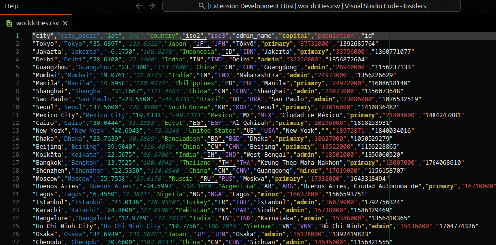

# List Tools (Convert / Extract List Data)

List tools helps you convert effortlessly between common list formats, such as `JSON`, `CSV`, `YAML` and programming languages such as `JavaScript`, `TypeScript`, `PHP` or `C`.

## Features

- Extract list data from data sources, such as `JSON`, `CSV`, `YAML`
- Extract simple or object list data from programming languages, such as `JavaScript`, `TypeScript`, `PHP` or `C`
- Convert simple or object lists between data sources and programming languages
- Extract single or multiple columns from object lists

## Known Limitations

- data sources and programming languages must be in a valid format
- extraction from programming languages only works in cases with simple key-value pairs
- converting tp programming languages may lead to invalid syntax when special characters are involved
